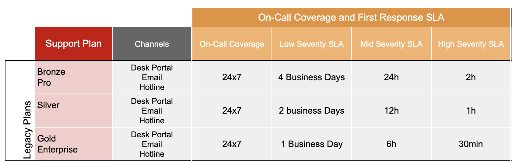

# Legacy Support

### **Legacy Support Plans**

No longer offered for new purchases since 1st July 2022.

* Silver
* Bronze
* Gold
* Pro
* Enterprise

_Legacy Support Plans are applied for the legacy products: Silver, Bronze, Gold, Pro, and Enterprise._

### Support Channels

There are three ways to contact Rocket.Chat for assistance:

#### **1. Rocket.Chat Desk Portal (all plans, including trial users)**

[https://desk.rocket.chat](https://desk.rocket.chat)

_Only customer-assigned points of contact can open a support ticket at the Desk Portal._

**2. Email (check supported plans)**

support@rocket.chat

_The email verification is done through the domain, i.e. email addresses that have the same domain as the company's domain will be redirected to the customer queue. If the domain is different, or a free domain, for example, they will not be identified as clients attached to that account._

#### **3. Hotline**: (check supported plans)

+1 (833) 479-0110

_For emergency cases only (High Severity), customers may contact Rocket.Chat through our landline._

### Ticket Severity

#### **High** Severity

(e.g., system down, main functions affected, a large number of users unable to access, severe performance problems)

Critical Business Impact: A critical issue occurring in Rocket.Chat Services that prevent business operations from occurring or a large number of users are prevented from working with no procedural workaround.

Example: Data loss or corruption; system crashes; critical functionality is not available; many users cannot work.

#### **Medium** Severity

(e.g., essential functions affected, significant impact on system usage, inconsistent performance)

Normal Business Impact: An issue causing a partial or non-critical loss of functionality on a production system. A small number of users are affected.

Example: Some systems functions are not available; not many users are impacted; minor performance problems.

#### **Low** Severity

(e.g., small impact to functions, low number of users affected, minor bugs, simple questions)

Minimal Business Impact: Issue occurring on non-production system or question, comment, feature request, documentation issue, or other non-impacting issues.

Example: Product questions

_Tickets created by email are automatically assigned as "Medium" priority and will have the associated SLA’s according to the account information. Customers entitled to paid support are recommended to raise tickets on the Support Portal._

### **Service Level Agreement (SLA)**

The SLAs are defined by \*\*\*\* taking into account the priority, the paid plan/product, and the customer account status.

The SLA times listed are the time frames in which customers can expect to receive the first response and are not to be considered as an expected time-to-resolution. Rocket.Chat Support team will make its best effort to address your case as quickly as possible.

#### Weekday and Weekend Coverage

12x5 - Support Specialists are actively responding to tickets MON-FRI, 8 AM BRT to 8 PM BRT.

24x7 - Support Specialist on-call 24 hours a day, 7 days a week.

